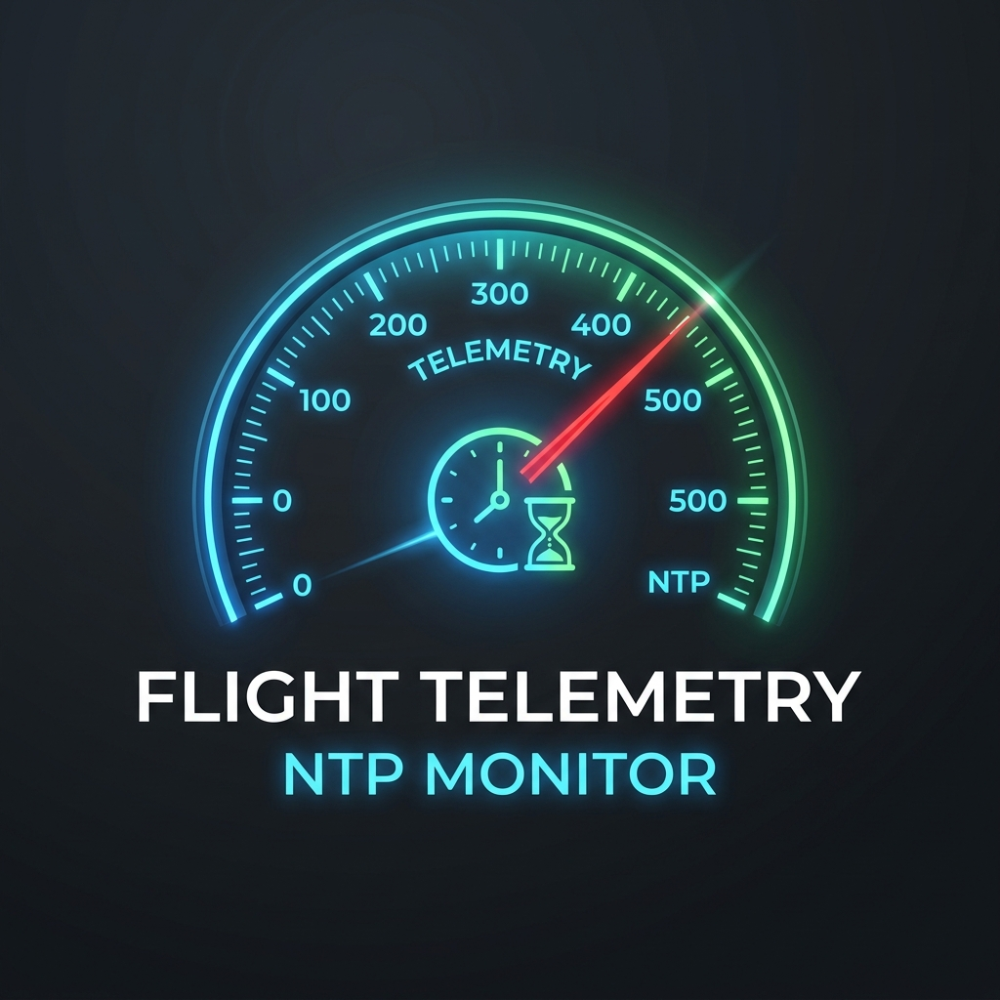
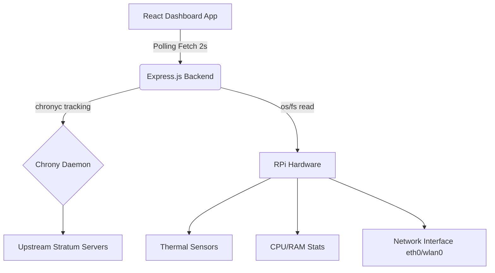

# Flight Telemetry NTP Monitor

<div align="center">
  
</div>

## Overview

The **Flight Telemetry NTP Monitor** is a state-of-the-art telemetry dashboard designed for a Raspberry Pi 4 acting as an NTP server. It seamlessly connects `chrony` clock synchronization metrics with actual real-time host system diagnostics. 

Designed with an "aircraft instrument panel" aesthetic, it utilizes robust React components, D3.js powered gauges, and an Express.js backend to serve up-to-the-second hardware and NTP analytics.

## Features

- **NTP Chrony Metrics:**
  - **Offset (ms):** Monitors the time drift of your local clock.
  - **Jitter (ms):** Tracks the variance in latency to upstream NTP servers.
  - **Frequency (ppm):** Real-time local oscillator drift frequency.
- **System Health Diagnostics:**
  - **CPU Usage (%):** Accurate processor utilization.
  - **Hardware Temperature (°C):** Direct sensor readout from the RPi4 `thermal_zone0`.
  - **RAM Usage (%):** Dynamic memory allocation.
  - **Network Transfer Rate (kB/s):** Aggregate Tx/Rx bandwidth measurement.
- **Sleek UI/UX:**
  - Dark mode, aircraft-style semicircular telemetry dials.
  - Color-coded operating zones (Green/Yellow/Red).
  - High-frequency 2-second polling for fluid needle animation.

## Screenshots & Diagrams

*Placeholders for screenshots and system architecture diagrams.*
- **Screenshots:** Add your dashboard images to the `screenshots/` directory.
- **Diagrams:** Add your architecture flowcharts to the `diagrams/` directory.

### Architecture



## Setup & Installation

### Prerequisites
- Node.js (v20+)
- NPM
- A running `chronyd` service.

### Installation

1. **Clone the repository:**
   ```bash
   git clone https://github.com/yourusername/chrony-monitor.git
   cd chrony-monitor
   ```

2. **Install dependencies:**
   ```bash
   npm install
   ```

3. **Build the React Application:**
   ```bash
   npm run build
   ```

4. **Start the Express Server:**
   ```bash
   ./start-monitor.sh
   # Or manually:
   # node server.cjs
   ```

5. **Access the Dashboard:**
   Open your browser and navigate to `http://<your-rpi-ip>:3000`.

## Architecture & Code Structure

- `src/App.tsx`: Main React component defining the layout and fetching logic.
- `src/App.css`: Dark mode flight-instrument styling and layout.
- `server.cjs`: Express backend acting as a local proxy. It directly accesses `os` resources and executes `chronyc` commands to gather metrics securely.
- `start-monitor.sh`: Daemon script to cleanly run the server in production mode.

## Troubleshooting

- **Server Crash (Cannot find module):** Ensure you are launching the backend from the project root (`cd /path/to/chrony-monitor`).
- **NTP Gauges Showing Zero:** Verify that `chronyd` is running (`sudo systemctl status chrony`) and the `chronyc tracking` command is accessible by the `node` process user.
- **Missing Temperature Data:** The temperature gauge reads directly from Linux `/sys/class/thermal/thermal_zone0/temp`. If running on non-RPi hardware, this may silently fail and default to 0.

## License

This project is licensed under the MIT License.
